# PROGRES 3 – IMPLEMENTASI DATABASE DAN PENGUJIAN

## Sistem Manajemen Aset dan Barang Inventaris Kantor

---

# 1. Script SQL DDL

## Membuat Database

```sql
CREATE DATABASE Sistem_Manajemen_Aset_Dan_Inventaris_Kantor;
USE Sistem_Manajemen_Aset_Dan_Inventaris_Kantor;
```

---

## Tabel USERS

```sql
CREATE TABLE users (
    id_user INT AUTO_INCREMENT PRIMARY KEY,
    nama_user VARCHAR(100) NOT NULL,
    username VARCHAR(50) NOT NULL UNIQUE,
    password VARCHAR(255) NOT NULL,
    role VARCHAR(20) NOT NULL
);
```

---

## Tabel KATEGORI

```sql
CREATE TABLE kategori (
    id_kategori INT AUTO_INCREMENT PRIMARY KEY,
    nama_kategori VARCHAR(100) NOT NULL,
    deskripsi TEXT
);
```

---

## Tabel LOKASI

```sql
CREATE TABLE lokasi (
    id_lokasi INT AUTO_INCREMENT PRIMARY KEY,
    nama_lokasi VARCHAR(100) NOT NULL,
    keterangan TEXT
);
```

---

## Tabel ASET

```sql
CREATE TABLE aset (
    id_aset INT AUTO_INCREMENT PRIMARY KEY,
    kode_aset VARCHAR(20) NOT NULL UNIQUE,
    nama_aset VARCHAR(100) NOT NULL,
    id_kategori INT NOT NULL,
    id_lokasi INT NOT NULL,
    tanggal_pengadaan DATE NOT NULL,
    nilai_aset DECIMAL(15,2) NOT NULL,
    kondisi VARCHAR(30) NOT NULL,
    status VARCHAR(30) NOT NULL,

    FOREIGN KEY (id_kategori)
    REFERENCES kategori(id_kategori),

    FOREIGN KEY (id_lokasi)
    REFERENCES lokasi(id_lokasi)
);
```

---

## Tabel PEMINJAMAN

```sql
CREATE TABLE peminjaman (
    id_peminjaman INT AUTO_INCREMENT PRIMARY KEY,
    id_aset INT NOT NULL,
    id_user INT NOT NULL,
    tanggal_pinjam DATE NOT NULL,
    tanggal_kembali DATE,
    status_peminjaman VARCHAR(20) NOT NULL,

    FOREIGN KEY (id_aset)
    REFERENCES aset(id_aset),

    FOREIGN KEY (id_user)
    REFERENCES users(id_user)
);
```

---

## Tabel PERAWATAN

```sql
CREATE TABLE perawatan (
    id_perawatan INT AUTO_INCREMENT PRIMARY KEY,
    id_aset INT NOT NULL,
    tanggal_perawatan DATE NOT NULL,
    jenis_perawatan VARCHAR(100) NOT NULL,
    biaya DECIMAL(15,2) NOT NULL,
    keterangan TEXT,

    FOREIGN KEY (id_aset)
    REFERENCES aset(id_aset)
);
```

---

# 2. Constraint yang Digunakan

## Primary Key (PK)

| Tabel      | Primary Key   |
| ---------- | ------------- |
| users      | id_user       |
| kategori   | id_kategori   |
| lokasi     | id_lokasi     |
| aset       | id_aset       |
| peminjaman | id_peminjaman |
| perawatan  | id_perawatan  |

---

## Foreign Key (FK)

| Tabel      | Foreign Key | Referensi             |
| ---------- | ----------- | --------------------- |
| aset       | id_kategori | kategori(id_kategori) |
| aset       | id_lokasi   | lokasi(id_lokasi)     |
| peminjaman | id_aset     | aset(id_aset)         |
| peminjaman | id_user     | users(id_user)        |
| perawatan  | id_aset     | aset(id_aset)         |

---

## UNIQUE

| Tabel | Kolom     |
| ----- | --------- |
| users | username  |
| aset  | kode_aset |

---

## NOT NULL

Kolom yang wajib diisi:

* nama_user
* username
* password
* role
* nama_kategori
* nama_lokasi
* kode_aset
* nama_aset
* tanggal_pengadaan
* nilai_aset
* kondisi
* status
* tanggal_pinjam
* status_peminjaman
* tanggal_perawatan
* jenis_perawatan
* biaya

---

# 3. Data Uji (INSERT)

## Data Users

```sql
INSERT INTO users
(nama_user, username, password, role)
VALUES
('Afif Fajriyananto','apip','apip2342','Admin'),
('Fakhrul Aqasya','farul','fapul2231','Petugas'),
('Hazza Syahfitra','hazza','hazza7783','Pegawai'),
('Muhammad Rizuar','rizuar','Zar12345','Pegawai'),
('Agus Saputra','agus','gusgus33','Petugas');
```

---

## Data Kategori

```sql
INSERT INTO kategori
(nama_kategori, deskripsi)
VALUES
('Elektronik','Perangkat elektronik kantor'),
('Furniture','Perabot kantor'),
('Kendaraan','Kendaraan operasional kantor'),
('ATK','Alat tulis kantor');
```

---

## Data Lokasi

```sql
INSERT INTO lokasi
(nama_lokasi, keterangan)
VALUES
('Ruang IT','Divisi Teknologi Informasi'),
('Ruang Administrasi','Bagian Administrasi'),
('Gudang','Tempat penyimpanan aset'),
('Ruang Meeting','Ruang rapat kantor');
```

---

## Data Aset

```sql
INSERT INTO aset
(kode_aset,nama_aset,id_kategori,id_lokasi,tanggal_pengadaan,nilai_aset,kondisi,status)
VALUES
('AST001','Laptop Lenovo',1,1,'2024-01-15',12000000,'Baik','Dipinjam'),
('AST002','Printer Epson',1,2,'2024-02-10',3500000,'Baik','Tersedia'),
('AST003','Meja Kerja',2,2,'2023-08-20',1500000,'Baik','Tersedia'),
('AST004','Mobil Operasional',3,3,'2022-05-10',180000000,'Baik','Dipinjam'),
('AST005','Proyektor Epson',1,4,'2024-03-12',7000000,'Baik','Tersedia');
```

---

## Data Peminjaman

```sql
INSERT INTO peminjaman
(id_aset,id_user,tanggal_pinjam,tanggal_kembali,status_peminjaman)
VALUES
(1,3,'2026-06-10',NULL,'Dipinjam'),
(4,2,'2026-06-11',NULL,'Dipinjam'),
(2,4,'2026-06-01','2026-06-05','Dikembalikan');
```

---

## Data Perawatan

```sql
INSERT INTO perawatan
(id_aset,tanggal_perawatan,jenis_perawatan,biaya,keterangan)
VALUES
(1,'2026-05-01','Pembersihan Sistem',100000,'Maintenance rutin'),
(2,'2026-05-15','Penggantian Tinta',250000,'Tinta habis'),
(4,'2026-04-20','Servis Mesin',500000,'Servis berkala kendaraan');
```

---

# 4. Query SQL

### Query 1 - Menampilkan Seluruh Data Aset

```sql
SELECT * FROM aset;
```

### Query 2 - Mencari Aset Berdasarkan Nama

```sql
SELECT *
FROM aset
WHERE nama_aset LIKE '%Laptop%';
```

### Query 3 - Menampilkan Aset Berdasarkan Kondisi

```sql
SELECT *
FROM aset
WHERE kondisi = 'Baik';
```

### Query 4 - Menampilkan Aset Yang Sedang Dipinjam

```sql
SELECT *
FROM aset
WHERE status = 'Dipinjam';
```

### Query 5 - Menampilkan Riwayat Peminjaman

```sql
SELECT
a.nama_aset,
u.nama_user,
p.tanggal_pinjam,
p.tanggal_kembali,
p.status_peminjaman
FROM peminjaman p
JOIN aset a ON p.id_aset = a.id_aset
JOIN users u ON p.id_user = u.id_user;
```

### Query 6 - Laporan Data Aset dan Kategori

```sql
SELECT
a.kode_aset,
a.nama_aset,
k.nama_kategori
FROM aset a
JOIN kategori k
ON a.id_kategori = k.id_kategori;
```

### Query 7 - Laporan Data Aset dan Lokasi

```sql
SELECT
a.kode_aset,
a.nama_aset,
l.nama_lokasi
FROM aset a
JOIN lokasi l
ON a.id_lokasi = l.id_lokasi;
```

### Query 8 - Laporan Riwayat Perawatan Aset

```sql
SELECT
a.nama_aset,
p.jenis_perawatan,
p.tanggal_perawatan,
p.biaya
FROM perawatan p
JOIN aset a
ON p.id_aset = a.id_aset;
```

### Query 9 - Analisis Jumlah Aset per Kategori

```sql
SELECT
k.nama_kategori,
COUNT(a.id_aset) AS jumlah_aset
FROM kategori k
LEFT JOIN aset a
ON k.id_kategori = a.id_kategori
GROUP BY k.nama_kategori;
```

### Query 10 - Analisis Total Nilai Aset

```sql
SELECT
SUM(nilai_aset) AS total_nilai_aset
FROM aset;
```

### Query 11 - Analisis Jumlah Aset Berdasarkan Nama Aset

```sql
SELECT
nama_aset,
COUNT(*) AS jumlah_aset
FROM aset
GROUP BY nama_aset;
```
---

# 5. Skenario Pengujian

| No | Skenario Pengujian                    |           Hasil           |
| -- | ------------------------------------- | ------------------------- |
| 1  | Menambah data user                    | Data berhasil tersimpan   |
| 2  | Menambah data kategori                | Data berhasil tersimpan   |
| 3  | Menambah data lokasi                  | Data berhasil tersimpan   |
| 4  | Menambah data aset                    | Data berhasil tersimpan   |
| 5  | Menambah data peminjaman              | Data berhasil tersimpan   |
| 6  | Menambah data perawatan               | Data berhasil tersimpan   |
| 7  | Menampilkan aset berdasarkan kondisi  | Data berhasil ditampilkan |
| 8  | Menampilkan aset yang sedang dipinjam | Data berhasil ditampilkan |
| 9  | Menampilkan laporan perawatan aset    | Data berhasil ditampilkan |
| 10 | Menampilkan jumlah aset per kategori  | Data berhasil ditampilkan |

---

# 6. Screenshot Hasil Implementasi dan Query

## Membuat Database

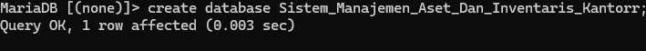

---

## Membuat Tabel User Sampai Aset

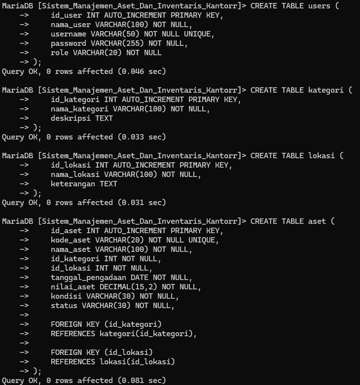

---

## Membuat Tabel Peminjaman Dan Perawatan

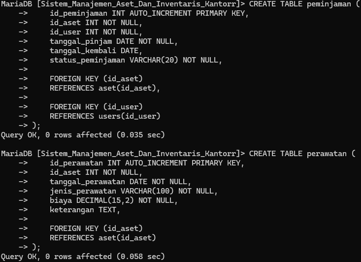

---

## Isi Tabel

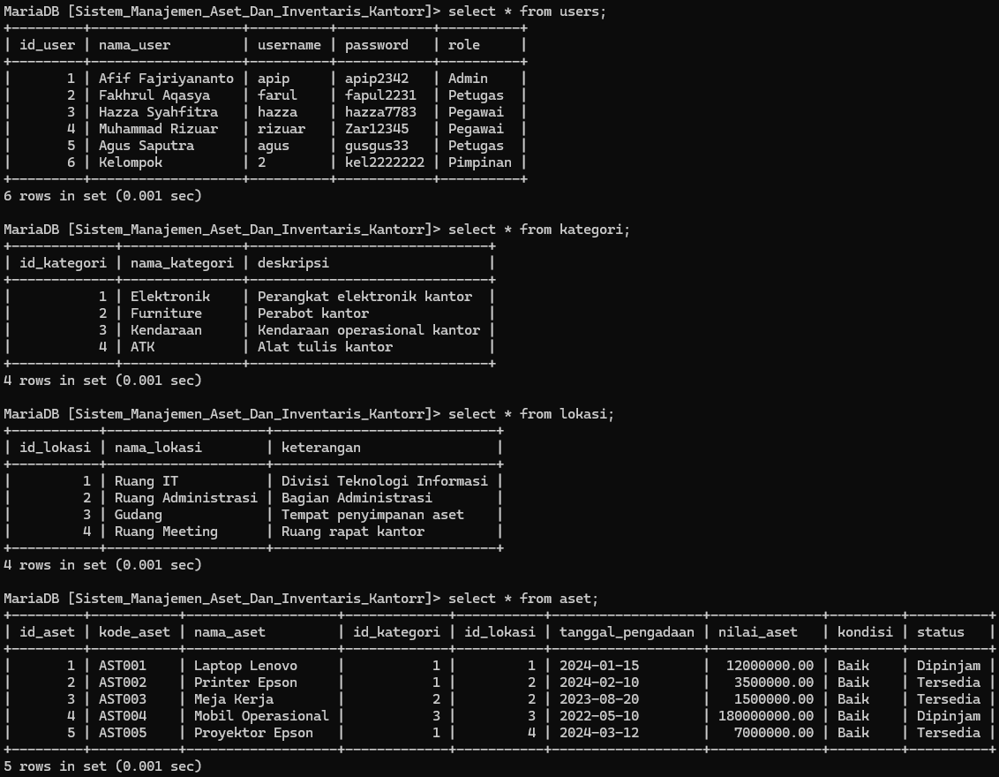

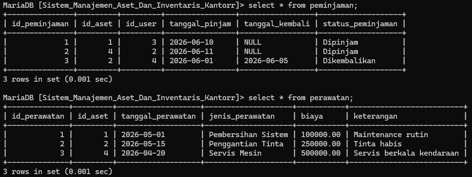

---

## QUERY:

Query1

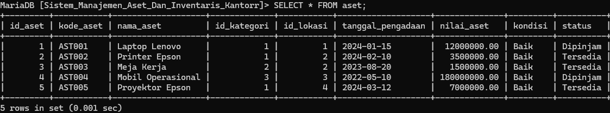

Query2

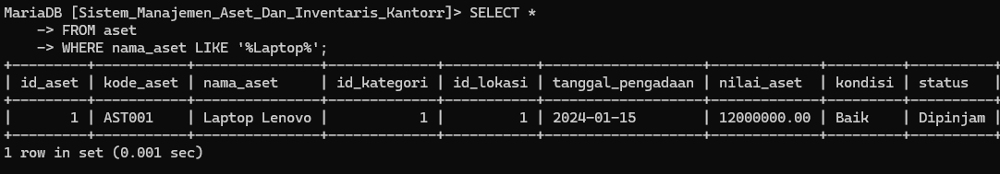

Query3

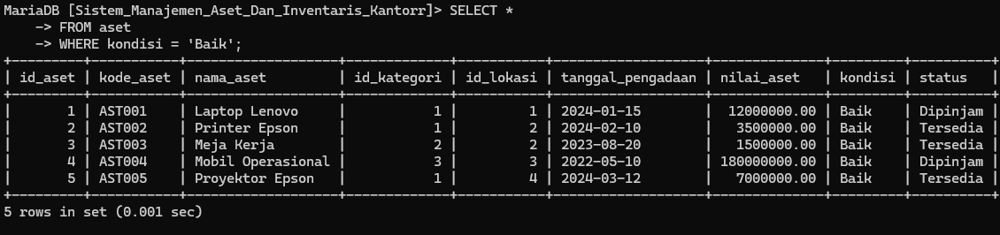

Query4

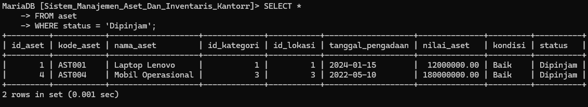

Query5

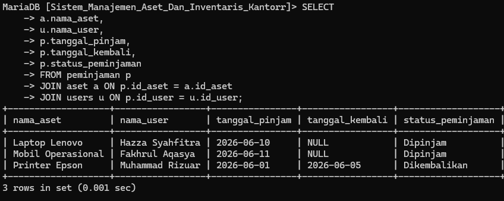

Query6

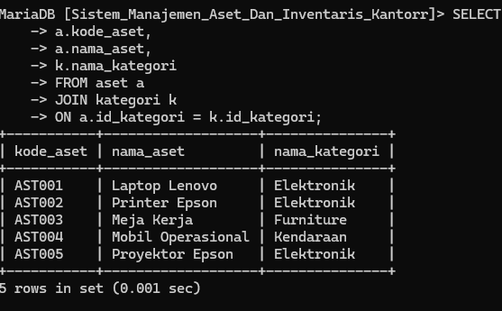

Query7

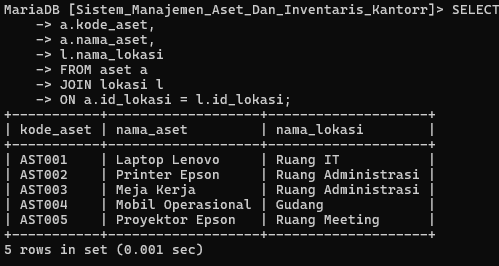

Query8

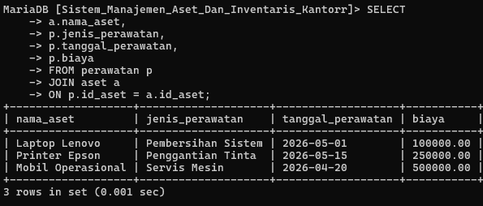

Query9

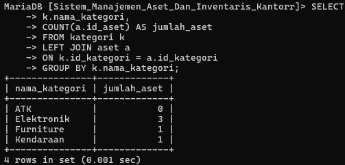

Query10

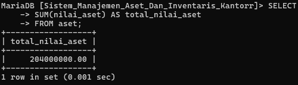

Query11

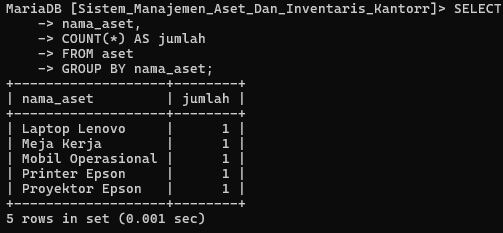

---

## Table Relasi
